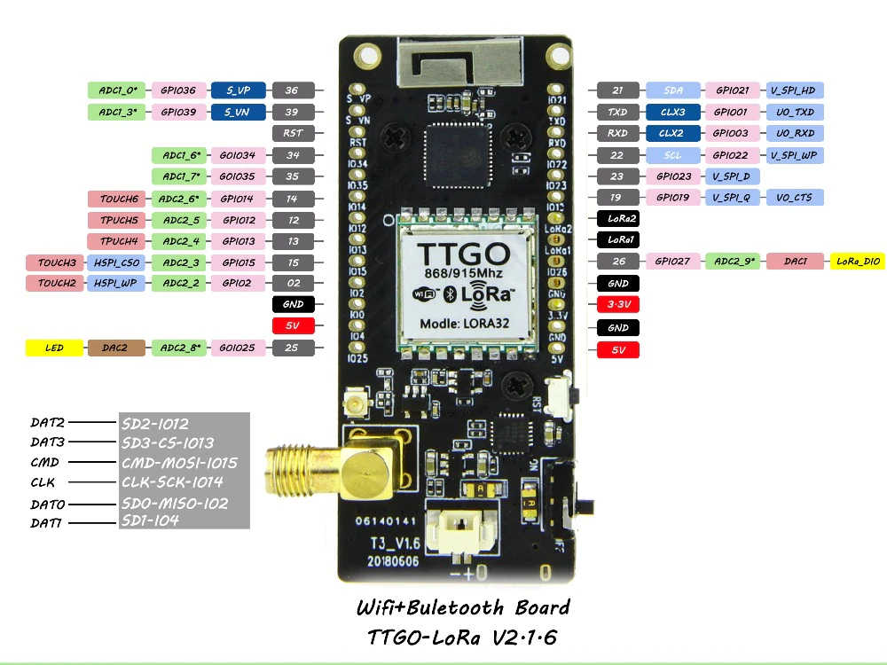

# Lektion 1 - Einleitung

In dieser Lektion wird ein Sensor, in diesem Fall ein Bosch BME280, mit dem TTGO LoRa32 Entwicklungsboard verbunden und ein Programm erstellt, mit dem die Sensorwerte über das I2C Protokoll ausgelesen werden. Die ausgelesenen Daten werden über die serielle Schnittstelle, über die das Entwicklungsboard an den Computer angebunden ist, ausgegeben.

# Sensor mit dem Entwicklungsboard verbinden

Das Entwicklungsboard muss mit dem Bosch BME280 verbunden werden. Die Anschlüsse des Boards sind dabei wie folgt belegt:

Der BME280 wird dabei mit 3.3V, GND, SCL (Pin 22) und SDA (Pin 21) des Entwicklungsboards verbunden.

# Software

Um den Bosch BME280 auslesen zu können, wird die Adafruit BME280 Sensor Bibliothek benötigt. In der Entwicklungsumgebung kann man sie über **"Sketch-Bibliothek-Bibliotheken verwalten..."** einbinden. Im Bibliotheksmanager gibt man dazu in der Suche **"BME280"** und wählt danach die **"Adafruit BME280 Library"** aus. Über **"Installieren"** wird die Bibliothek dann auf dem Rechner installiert und kann zum Auslesen der Sensorwerte verwendet werden.

Den kompletten Sketch zum Auslesen findet man in diesem Verzeichnis:

* [bme280.ino](bme280.ino)

